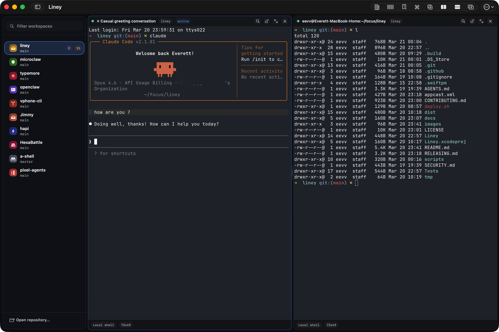

# Liney

[](https://liney.dev)
[](https://discord.com/invite/eGzEaP6TzR)
[](https://github.com/everettjf/liney/stargazers)
[](./LICENSE)
[](https://liney.dev)

Liney is a native macOS terminal workspace manager for developers who jump between repositories, worktrees, branches, and split-pane sessions all day.

It combines a fast workspace sidebar, persistent pane layouts, and Ghostty-powered terminal surfaces into one focused desktop app.



## Links

- Website: <https://liney.dev>
- Discord: <https://discord.com/invite/eGzEaP6TzR>
- GitHub: <https://github.com/everettjf/liney>
- Releases: <https://github.com/everettjf/liney/releases>

## Why Liney

- Keep multiple repositories and worktrees open in one place.
- Move through split panes without losing context.
- Launch local shell, SSH, and agent-backed sessions from the same workspace.
- Preserve per-worktree layout state so real-world multitasking stays manageable.
- Stay fully native on macOS with AppKit, SwiftUI, and vendored Ghostty integration.

## Features

- Native AppKit app with a SwiftUI workbench UI
- Ghostty-backed terminal surfaces via the vendored `GhosttyKit.xcframework`
- Multi-repository sidebar with pinning, archiving, drag reordering, and worktree actions
- Split panes with per-worktree layout persistence
- Local shell, SSH, and agent-backed terminal sessions
- Optional GitHub integration through `gh`
- Signed in-app updates through Sparkle

## Requirements

- macOS 14+
- Apple Silicon Mac for the committed vendored Ghostty binary
- Xcode 16+ with command line tools
- `gh` is optional and only needed for GitHub features and release publishing

Release builds also require the Metal toolchain component used by Ghostty:

```bash
xcodebuild -downloadComponent MetalToolchain
```

## Quick Start

Build the app:

```bash
xcodebuild \
  -project Liney.xcodeproj \
  -scheme Liney \
  -configuration Debug \
  -destination 'platform=macOS,arch=arm64' \
  build
```

Run the full test suite:

```bash
xcodebuild \
  -project Liney.xcodeproj \
  -scheme Liney \
  -destination 'platform=macOS,arch=arm64' \
  test
```

Launch the debug build:

```bash
open ~/Library/Developer/Xcode/DerivedData/Liney-*/Build/Products/Debug/Liney.app
```

## Project Layout

```text
Liney/
├─ App/
├─ Domain/
├─ Persistence/
├─ Services/
│  ├─ Git/
│  ├─ Process/
│  └─ Terminal/
│     └─ Ghostty/
├─ Support/
├─ UI/
└─ Vendor/
```

## Docs

- Testing guide: [`docs/testing.md`](./docs/testing.md)
- Terminal architecture: [`docs/terminal-architecture.md`](./docs/terminal-architecture.md)
- Release process: [`RELEASING.md`](./RELEASING.md)
- Contributing guide: [`CONTRIBUTING.md`](./CONTRIBUTING.md)
- Security policy: [`SECURITY.md`](./SECURITY.md)

## Data

Liney stores workspace state and app settings in `~/.liney/`, and still reads legacy state from `~/Library/Application Support/Liney/` when present.

## Release Build

```bash
scripts/build_macos_app.sh
open dist/Liney.app
```

Optional variables:

- `SIGNING_IDENTITY="Developer ID Application: Your Name (TEAMID)"` to sign the `.app`
- `OUTPUT_DIR=/custom/output/path` to change the output folder

The committed `GhosttyKit.xcframework` currently includes a macOS `arm64` slice only. If you want Intel or universal releases, regenerate the vendored framework before changing `RELEASE_ARCHS`.

The build script emits:

- `dist/Liney.app`
- `dist/Liney-<version>.dmg`

## Auto Updates

Liney uses Sparkle for signed app updates.

To prepare the signing key on a release machine:

```bash
scripts/setup_sparkle_keys.sh
```

This exports the private key to `~/.liney_release/sparkle_private_key` and prints the public key that must stay in the app target's `SUPublicEDKey`.

Because Liney is open source, keep the private key outside this repository. A private release-infra repo, CI secret store, or dedicated release machine is the right place for it.

## Publish

The root release entrypoint is:

```bash
./deploy.sh
```

By default it:

- bumps the patch version
- increments the build number by 1
- signs and notarizes release artifacts
- updates GitHub releases, Sparkle appcast metadata, and the Homebrew tap

`scripts/deploy.sh` still exists as a compatibility wrapper.

## Current Limitations

- The main supported local development path is the Xcode project
- Ghostty is required for the terminal stack
- Worktree switching restarts active panes after confirmation so their cwd always matches the newly selected worktree
- Session persistence restores per-worktree layout, zoom state, and pane cwd, but relaunch still recreates fresh shell processes
- Some GitHub workflow features expect `gh` to be installed and authenticated

## Community

If you are building on Liney, trying it in daily work, or exploring improvements:

- Star the project on GitHub
- Join the Discord community
- Open an issue or discussion with concrete workflow feedback

## License

Released under the Apache License 2.0. See [`LICENSE`](./LICENSE).
